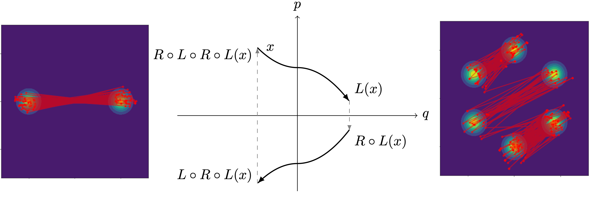

# 🚀 `Ai-sampler`

## *Learning to sample with Adversarial Involutive Markov kernels.*

Creators: [Evgenii Egorov](https://github.com/evgenii-egorov), [Riccardo Valperga](https://twitter.com/RValperga)

[](https://opensource.org/licenses/MIT)
[](https://www.python.org/downloads/release/python-390/)
[](https://github.com/psf/black)



📚 This code is for reproducing the experiments in:  [Ai-sampler: Adversarial Learning of Markov kernels with involutive maps](https://arxiv.org/abs/2406.02490) .

## Getting started with 🚀 `Ai-sampler`

### Installation

To ensure that JAX and PyTorch are installed with the right CUDA/cuDNN version of your platform, we recommend installing the GPU-supported [JAX](https://jax.readthedocs.io/en/latest/installation.html) and CPU-only [Pytorch](https://pytorch.org/get-started/locally/).


To use this library, simply clone the repository, create a conda environment and install the dependencies with:

```bash
conda create -n aisampler python=3.10
conda activate aisampler
pip install -r requirements.txt
```
then install the library by running

```bash
pip install -e .
```

**Note**: the library supports `wandb` for better logging.

### Repository structure

The repository is structured as follows:

- `./aisampler`. **Library** source code that implements the `Ai-sampler`. 
- `./data`. Contains the data for Bayesian logistic regression.
- `./experiments`. **Collection** of the experiments.
- - `/train`. Scripts for training the `Ai-sampler`.
- - `/test`. Scripts for sampling with the trainied `Ai-sampler` and with HMC.

### Usage

To train the `Ai-sampler` on the **2D densities**, from the root folder run:

```bash
python experiments/train/train_toy_density.py --task.target_density_name=hamiltonian_mog2  --task.train.num_epochs=51 --task.checkpoint.checkpoint_dir=./checkpoints --task.checkpoint.save_every=50
```
Checkpoints are saved every `save_every` epochs into `checkpoint_dir`. To sample using the trained `Ai-sampler` run:

```bash
python experiments/test/sample_aisampler_toy_density.py --task.target_density_name=hamiltonian_mog2 --task.checkpoint.checkpoint_dir=./checkpoints --task.checkpoint.checkpoint_epoch=50 --task.num_parallel_chains=10 --task.num_iterations=1000 --task.burn_in=100
```
where `num_parallel_chains` sets the number of Markov chains run in parallel, `num_iterations` the length of the chains (after `burn_in`).

To train the `Ai-sampler` on the **Bayesian logistic regression posterior**, from the root folder run:

```bash
python experiments/train/train_logistic_regression.py --task.dataset_name=Heart  --task.train.num_epochs=200 --task.checkpoint.checkpoint_dir=./checkpoints --task.checkpoint.save_every=50
```

To sample from the trained `Ai-sampler` run:

```bash
python experiments/test/sample_aisampler_logistic_regression.py --task.dataset_name=Heart --task.checkpoint.checkpoint_dir=./checkpoints --task.checkpoint.checkpoint_epoch=400 --task.num_parallel_chains=10 --task.num_iterations=1000 --task.burn_in=100
```


## Citing

If you want to cite us use the following BibTeX entry:

```bibtex
@article{egorov2024ai,
  title={Ai-Sampler: Adversarial Learning of Markov kernels with involutive maps},
  author={Egorov, Evgenii and Valperga, Ricardo and Gavves, Efstratios},
  journal={arXiv preprint arXiv:2406.02490},
  year={2024}
}
```